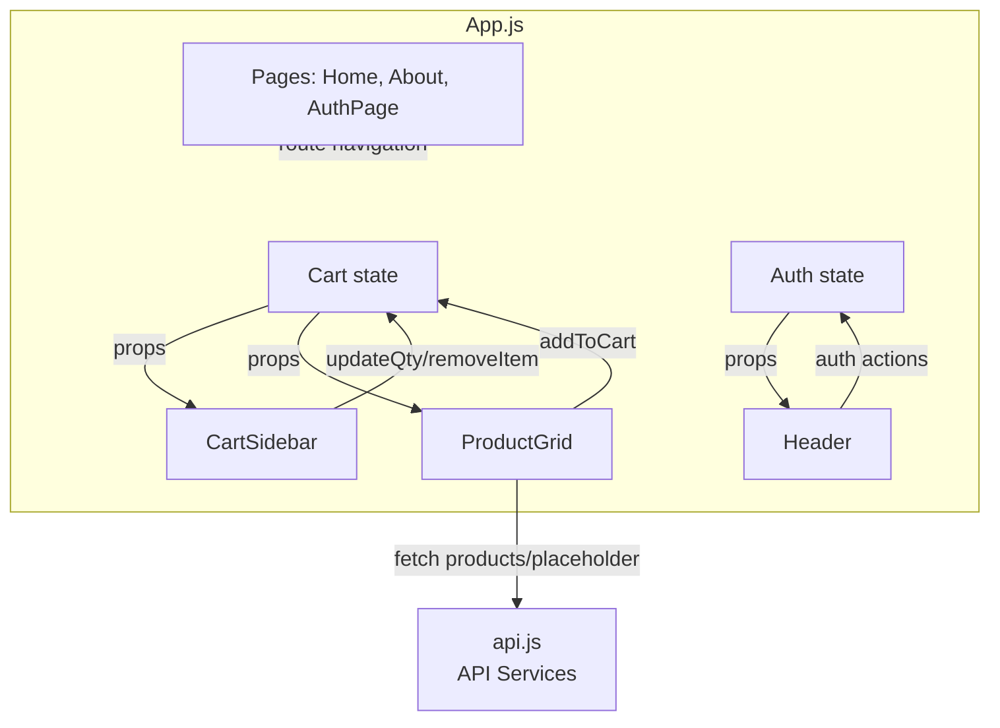
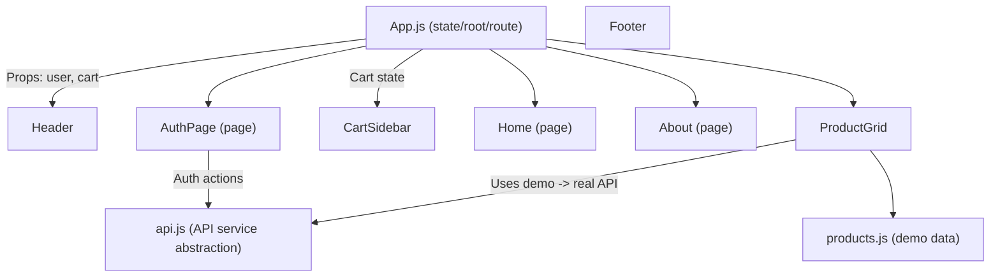

# Stationery Shop Frontend: Architecture and Product Requirements Document

## 1. System Architecture Overview

The **Shopping Frontend** is a modern, lightweight React application designed for browsing, shopping, and authenticating users in an online stationery shop. The system is intentionally modular with minimal dependencies—using React, React Router, and vanilla CSS—ensuring excellent performance, simple maintenance, and maximum customizability.

**Current Mode:**  
The application is a demo/prototype using in-memory ("local") data and mock authentication flows. A placeholder REST API layer is defined, ready for seamless swap-in with real backend services.

**Platform:**  
- Web: Responsive, works across desktop/tablet/mobile.
- Built with React 18 and React Router v6.
- CSS is managed directly, with theme variables and responsive layouts.

**Planned Extensibility:**  
- Integration with a true backend via REST calls is planned (API interface is abstracted and ready).
- Backend data sources for products, user authentication, and order processing will be slotted into the provided service layer.
- Architecture enables future support for state management frameworks or third-party plugins.

---

## 2. Component Structure

The UI is organized by logical, stateless (where possible) components. The main structure is as follows (files are in `src/`):

- **App.js**:  
  Top-level routing, grid layout, and state management for cart, theme, and user authentication.

- **/components**
  - `Header.js`: Navigation bar with theme toggling, links, and auth controls.
  - `Footer.js`: Contact/About links and copyright.
  - `ProductGrid.js`: Displays products in a responsive grid; handles add-to-cart.
  - `CartSidebar.js`: Manages and displays cart, updates/removal of items.
  
- **/pages**
  - `Home.js`: Hero intro, personalized welcome, summary.
  - `About.js`: Author/site information.
  - `AuthPage.js`: Demo authentication (sign-in/sign-up placeholder).

- **/services**
  - `api.js`: Placeholder API abstraction for product listing and authentication.
    - Intended to be replaced with real backend HTTP requests.

- **/data**
  - `products.js`: Demo product catalog (arrays/objects).

**State Flow:**
- Cart and user state are maintained at the App level and passed down as props.
- Cart actions (add, update qty, remove) are handled in App and CartSidebar.
- Authentication is demo-only, updating a simple user state object.

**Theme Handling:**
- Theme (light/dark) is toggleable and applied globally to the `:root` via CSS variables.

---

## 3. UI Layout & Data Flow

### Layout Structure

- **Header**: Persistent, at top; contains logo, navigation links (Home, About), theme toggle, and auth section (Sign In/Up or user info & Logout).
- **Main Content (`<main>`)**:
  - Home: Product grid + hero.
  - About/Auth: Show respective dedicated sections.
- **Cart Sidebar (`<aside>`)**:  
  Visible on all routes except About/Auth. Contains cart summary, item management, and checkout button.
- **Footer**:  
  Contact info, About link.

**CSS/Responsiveness:**  
- Uses CSS grid, media queries for layout adaptation (sidebar collapses for small screens).
- Theme switches via CSS variables.

### Data/State Flow

- **Cart and auth states** are lifted to App, keeping all relevant components in sync.
- **ProductGrid** simulates a fetch (real endpoint ready in service API).
- **Header** reflects auth state, theme, and coordinates sign in/out.
- **CartSidebar** visualizes cart contents, allows quantity adjustments, removal, and checkout (checkout is a demo, not functional yet).

---

## 4. API/Service Abstraction

### `src/services/api.js`

- Provides an abstraction/wrapper for all REST API interactions:
  - `fetchProducts()`: To supply products; currently throws (demo), expects swap with real implementation.
  - `authSignup({email, password, name})` / `authSignin({email, password})`: Demo authentication; to become POST requests to `/api/signup` and `/api/signin`.
- **Pattern:** All UI features invoke service functions, not direct HTTP—enabling future backend integration with minimal changes.

---

## 5. Integration & Extensibility Notes

- **Backend Integration Points:**
  - **Product Data:** Swap `ProductGrid` to fetch from backend via `fetchProducts()`.
  - **Authentication:** Replace stubbed auth flows in `AuthPage` with real API endpoints.
  - **Cart Actions:** Future: persist cart/user actions to backend (orders).

- **Further Extensibility:**
  - Simple to plug in Redux or context-based state management if needed for more complex flows.
  - API service layer can be extended for order processing, user profile, etc.
  - Design allows introduction of feature flags, analytics, A/B testing, etc.

- **External Config/Env:**  
  No unique `.env` variables currently required; backend URL, auth secrets, and feature toggles should be managed via environment variables when services are implemented.

---

## 6. Current Limitations Summary

- **Demo Only:**  
  No actual backend; all API calls in `api.js` are mocked/stubbed.

- **Auth is Non-persistent:**  
  Auth state is in-memory only. No secure session/cookie/token implementation yet.

- **Cart is Local:**  
  Cart state is lost on reload; not stored or synced to backend.

- **No Real Checkout:**  
  "Checkout" button is disabled. Full payment/order flow to be built.

- **Accessibility/Testing:**  
  UI is responsive and modern, but may need more accessibility polish and coverage by E2E tests.

- **No internationalization/localization (i18n)** at this stage.

---

## 7. Future Development Guidelines

- Implement real REST API endpoints in `api.js` and connect them to backend.
- Add persistent authentication with tokens and secure session handling.
- Sync cart and orders to backend.
- Incrementally introduce tests, accessibility improvements, and new features (e.g., user profiles, product search, payments).
- Add support for environment configuration as integration needs grow.

---

## 8. Visual Overview (Structure)

---

## 9. References & Codebase Map

- Main directory: `src/`
  - Core: `App.js`, `index.js`
  - UI: `/components`
  - Pages: `/pages`
  - Services: `/services/api.js`
  - Data: `/data/products.js`
  - Styles: `App.css`, `index.css`

For more, see included README, code comments, and skeleton service layers in the repo.

---

*Document last updated: [auto-generated; sync with current codebase].*
